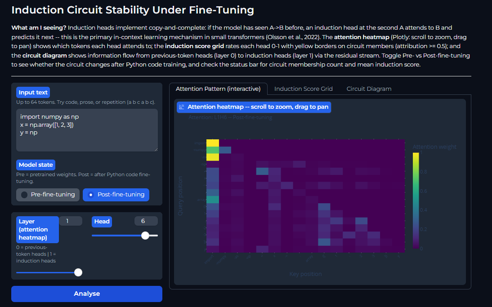

# Mechanistic Interpretability Study: Induction Circuit Stability Under Fine-Tuning

> **TL;DR:** We are tracking exactly what happens to the internal "circuitry" (induction heads) of a 2-layer attention-only Transformer when forced to undergo domain adaptation from prose to structured Python code.

This repository contains a rigorous, reproducible mechanistic interpretability study that maps the exact training checkpoints where a transformer alters its internal circuits. By measuring per-head induction scores, direct logit attributions, and activation-patching effects at every 100-step interval across multiple random seeds, we show how fragile sub-networks evolve or degrade under fine-tuning.

*If you are interested in AI safety, mechanistic alignment, or tracking phase changes in neural networks under the hood, this project is for you.*

<div align="center">
  <a href="https://huggingface.co/spaces/Mattral/induction-circuit-stability" target="_blank">
    
  </a>
  <p>
    <b>Interactive Dashboard:</b> <a href="https://huggingface.co/spaces/Mattral/induction-circuit-stability">Try it live on Hugging Face Spaces</a>
  </p>
</div>

---

## 📖 Experimental Design & Core Questions

Do structural circuits learned during foundational pre-training survive domain adaptation, or does the network overwrite them to accommodate highly structured syntax? We target three definitive research avenues:

1. **Circuit Degradation vs. Adaptation:** Do pre-existing induction heads degrade entirely, or do they transition into code-specific induction variants?
2. **Phase Change Dynamics:** At what precise training step do structural phase changes materialize within attention layers?
3. **Causal Mapping:** Can we mathematically map intermediate structural states during the fine-tuning trajectory?

### Stated-A-Priori Hypotheses

| ID | Hypothesis | Operational Metric | Quantitative Threshold |
| --- | --- | --- | --- |
| **H1** | Induction circuit degrades rapidly in the first 20% of fine-tuning steps. | IS Drop | $\Delta \text{IS} \ge 0.1$ |
| **H2** | A code-specific induction variant forms during late-stage alignment. | IS Rise on Code Patterns | $\Delta \text{IS} \ge 0.1$ |
| **H3** | Prose fine-tuning causes significantly less structural degradation than code. | $\Delta\text{IS}_{\text{code}}$ vs $\Delta\text{IS}_{\text{prose}}$ | $p < 0.05$ |

### Mathematical Definition of Induction Score (IS)

Following Olsson et al. (2022), for a repeated token sequence $[t_1, \dots, t_n, t_1, \dots, t_n]$, the canonical induction score for layer $l$ and head $h$ is evaluated as:

$$\text{IS}(l,h) = \frac{1}{n} \sum_{i=1}^{n} A^{(l,h)}[n+i,\; i]$$

Scores are averaged over 500 generated sequences with a sequence half-length of 50. An absolute delta $\ge 0.1$ denotes a practically meaningful a-priori circuit shift.

---

## 🗺️ Repository Structure

We design our research codebase to read like a structured document. The codebase is broken down into modular operational segments:

```
├── PAPER_CHECKLIST.md          ← Execution track for all project deliverables
├── pyproject.toml              ← Package configuration, dependency locks & build system
├── environment.yml             ← Reproducible Conda environment specification
├── paper/                      ← LaTeX publication draft (NeurIPS format) & assets
├── decisions/DECISION_LOG.md   ← System diary logging every non-obvious methodological pivot
├── experiments/configs/        ← Declarative YAML configurations (baseline, code, prose)
├── notebooks/                  ← Phase-by-phase interactive replication scratchpads
│   ├── 01_replication.ipynb    Phase 1: Replicate foundational induction circuits
│   ├── 02_patching.ipynb       Phase 2: Causal verification via activation patching
│   ├── 03_finetuning.ipynb     Phase 3: Multi-seed fine-tuning loop (prose vs code)
│   ├── 04_adversarial.ipynb    Phase 4: Checkpoint sweeps, smoothing & adversarial probes
│   └── 05_figures.ipynb        ★ Single source of truth for all publication-ready figures
├── src/                        ← Core tested source package
│   ├── model/                  Model definitions, configs, and training execution loops
│   ├── circuits/               Low-level interpretability hooks (IS, patching, DLA)
│   ├── analysis/               Checkpoint sweeping, phase smoothing & probe engines
│   └── viz/                    Attention visualization engines & local Gradio dashboards
└── huggingface_space/          ← Deployment bundle for Hugging Face Spaces interface

```

---

## ⚠️ Transparent Limitations

* **Model Scope:** This study is strictly bounded within a **2-layer attention-only transformer architecture**. These findings offer clean, isolated mathematical clarity, but they *do not* automatically scale linearly to heavy Multi-Layer Perceptrons (MLPs) or massive frontier architectures (e.g., Llama 3 or GPT-4).
* **Domain Bounding:** Fine-tuning datasets focus entirely on Python code and standard linguistic prose benchmarks.

---

## 🚀 Quickstart

Ensure you have a local environment running Python 3.10.

### 1. Clone & Environment Set Up

```bash
# Clone the repository
git clone https://github.com/Mattral/Mechanistic-Interpretability-Study-Induction-Circuit-Stability-Under-Fine-Tuning.git
cd Mechanistic-Interpretability-Study-Induction-Circuit-Stability-Under-Fine-Tuning

# Provision the environment
conda env create -f environment.yml
conda activate mech-interp-induction

# Install package locally in editable mode
pip install -e .

```

### 2. Execute the Pipeline

Run the implementation files in order to generate results from scratch:

```bash
jupyter notebook notebooks/01_replication.ipynb    # ~5 min CPU  — Establish baseline metrics
jupyter notebook notebooks/02_patching.ipynb       # ~15 min CPU — Causal verification 
jupyter notebook notebooks/03_finetuning.ipynb     # ~80 min GPU — Multi-seed training execution
jupyter notebook notebooks/04_adversarial.ipynb    # ~30 min CPU — Checkpoint sweep & detection
jupyter notebook notebooks/05_figures.ipynb        # ~5 min CPU  — Render publication figures

```

### 3. Spin Up the Local Dashboard

Once step `03` saves checkpoints locally, convert weights and launch your interactive visualization engine:

```bash
python src/viz/dashboard/onnx_export.py \
    --pre checkpoints/code_seed42/step_000000.pt \
    --post checkpoints/code_seed42/step_005000.pt

python src/viz/dashboard/app.py
# View the local dashboard interface at http://localhost:7860

```

---

## 🧪 Comprehensive Test Suite

We maintain strict test integrity across all core metrics. All unit and integration tests run entirely on a standard CPU node (automatically provisions a ~25MB toy model on initialization).

```bash
# Execute full testing suite with verbose readout
pytest tests/ -v

```

| Target File | Test Coverage Mapping |
| --- | --- |
| `test_config.py` | Config validations, structural parameter typing, initialization limits |
| `test_induction_score.py` | Dimensionality checks, boundary ranges, isolated tracking of known vs non-IS heads |
| `test_patching.py` | Counterfactual prompt generation, activation tracking, clean vs corrupted logit states |
| `test_reproducibility.py` | Global seed determinism, model check-pointing round-trips, identical training loss profiles |
| `test_phase_detection.py` | Savitzky-Golay filtering stability and mathematical edge cases in transition alarms |

---

## 🛠️ Code Quality Standards

* **Formatting:** `black` (line-length=88), `ruff`, and `isort` configurations strictly enforced via pre-commit hooks.
* **Type Safety:** `mypy --strict` passing across all modular modules in `src/`.
* **Standard Logging:** Structured via unified formatting: `%(asctime)s | %(levelname)-8s | %(name)s | %(message)s` utilizing strict ISO 8601 timestamps.

---

## 🤝 References

* Elhage et al. (2021). *A Mathematical Framework for Transformer Circuits.*
* Olsson et al. (2022). *In-Context Learning and Induction Heads.*
* Wang et al. (2022). *Interpretability in the Wild: Localization of an Indirect Object Identification Circuit.*
* Conmy et al. (2023). *Towards Automated Circuit Discovery for Language Models.*

---

**Authors:** [Mattral](https://github.com/Mattral) | **License:** Apache 2.0 License (See [LICENSE](https://www.google.com/search?q=LICENSE))
